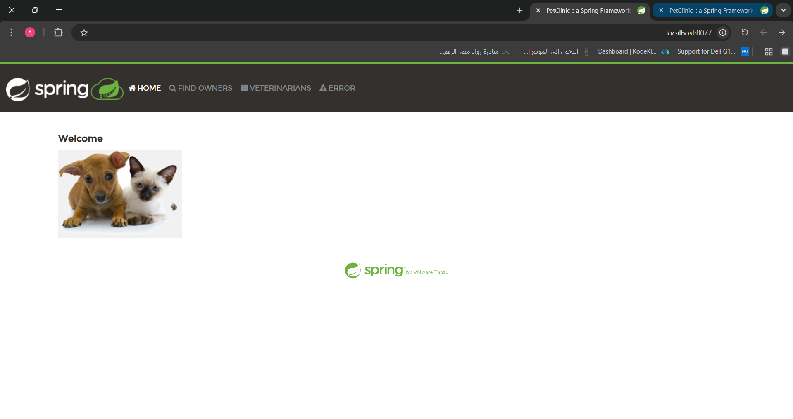
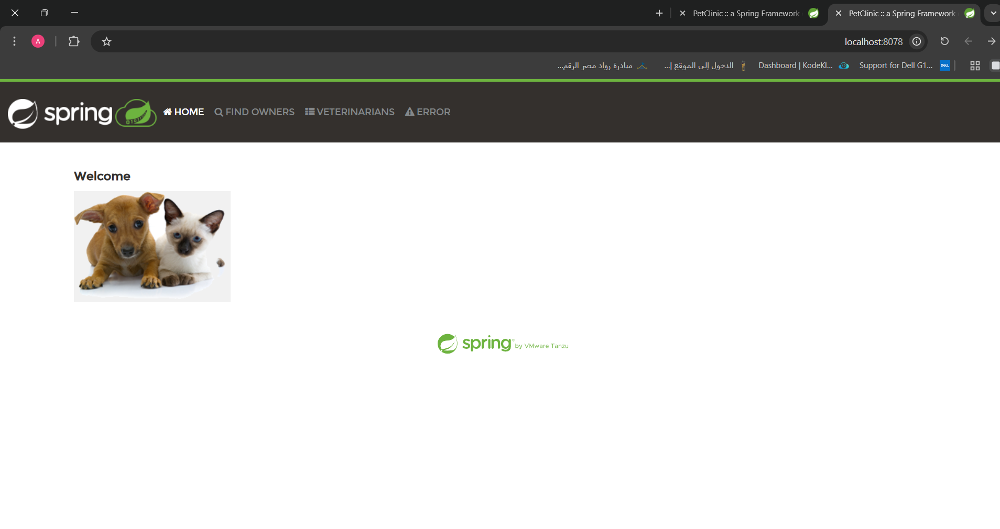

# 🐳 Spring PetClinic with Docker

This project demonstrates how to containerize the **Spring PetClinic** application using two different Dockerfile strategies:

- **`latest`** → Single-stage build (big image, ~1.17GB)  
- **`multii`** → Multi-stage build (optimized, ~380MB)  

The goal is to understand the difference between both approaches in terms of **image size, efficiency, and usage**.

---

## 🚀 Running the Containers

After building both images, you can run them like this:

```bash
# Run the "latest" image on port 8077
docker run -d -p 8077:8080 spring-petclinic:latest

```

```bash

# Run the "multii" image on port 8078
docker run -d -p 8078:8080 spring-petclinic:multii
```

```bash
# Check containers
docker ps
```


✅ Example output:

```
CONTAINER ID   IMAGE                     COMMAND                  STATUS          PORTS                                         NAMES
e3707feb8068   spring-petclinic:multii   "java -jar spring-p…"   Up 16 seconds   0.0.0.0:8078->8080/tcp, [::]:8078->8080/tcp   sad_pascal
cd33cd265b9c   spring-petclinic:latest   "java -jar target/…"   Up 43 seconds   0.0.0.0:8077->8080/tcp, [::]:8077->8080/tcp   angry_fermat
```

---

## 📂 Dockerfile: `latest` (Single-stage Build)

```dockerfile
FROM eclipse-temurin:17-jdk

WORKDIR /app

COPY . /app

RUN apt-get update && apt-get install -y maven && rm -rf /var/lib/apt/lists/*

RUN mvn package -DskipTests

EXPOSE 8080

CMD ["java", "-jar", "target/spring-petclinic-3.5.0-SNAPSHOT.jar"]
```

### 🔎 Explanation
- Uses **JDK image** (big size).  
- Installs **Maven inside container** → extra ~200MB.  
- Builds the JAR inside the same image.  
- Keeps all files (`.m2`, source code, dependencies).  
- **Final size ~1.17GB.**

✅ Very simple (everything in one image).  
❌ Very large → slow to push/pull, heavy for production.

---

## 📂 Dockerfile: `multii` (Multi-stage Build)

```dockerfile
# Stage 1: Build
FROM eclipse-temurin:17-jdk-alpine AS build
WORKDIR /app
COPY . .
RUN ./mvnw package -DskipTests

# Stage 2: Run
FROM eclipse-temurin:17-jre-alpine
WORKDIR /app
COPY --from=build /app/target/spring-petclinic-*.jar spring-petclinic.jar
EXPOSE 8080
CMD ["java", "-jar", "spring-petclinic.jar"]
```

### 🔎 Explanation
- **Stage 1 (build stage):**
  - Uses **JDK** with Maven wrapper to build the app.  
  - Runs `mvnw package -DskipTests`.  
  - Produces the final `.jar` file.  

- **Stage 2 (run stage):**
  - Uses a much lighter **JRE image**.  
  - Copies only the final JAR file.  
  - Runs the app with `java -jar spring-petclinic.jar`.  

📦 **Final size ~380MB** (3× smaller than `latest`).  

✅ Optimized and clean.  
✅ Much faster to upload/download.  
❌ Slightly more advanced to write.

---

## 📊 Comparison

| Feature             | `latest` (Single-stage)      | `multii` (Multi-stage)   |
|---------------------|-------------------------------|---------------------------|
| Base Image          | Full JDK + Maven             | JDK (build) + JRE (run)  |
| Build Process       | All in one stage             | Separate build & run      |
| Files in Image      | Source + Maven cache + JAR   | Only final JAR            |
| Final Size          | ~1.17GB                     | ~380MB                   |
| Push/Pull Speed     | Slow                        | Fast                     |
| Best For            | Local debugging / testing    | Production deployment     |
---


## ✅ Recommendation
- Use **`multii`** in production → smaller, faster, cleaner.  
- Use **`latest`** only if you need a quick, simple image with everything inside.  

---

## 🔨 Build Commands

```bash
# Build latest
docker build -t spring-petclinic:latest -f Dockerfile.latest .


# Build multii
docker build -t spring-petclinic:multii -f Dockerfile.multii .
```
